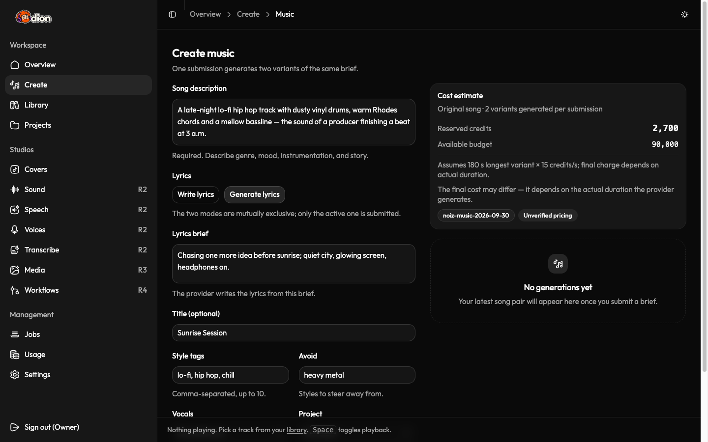
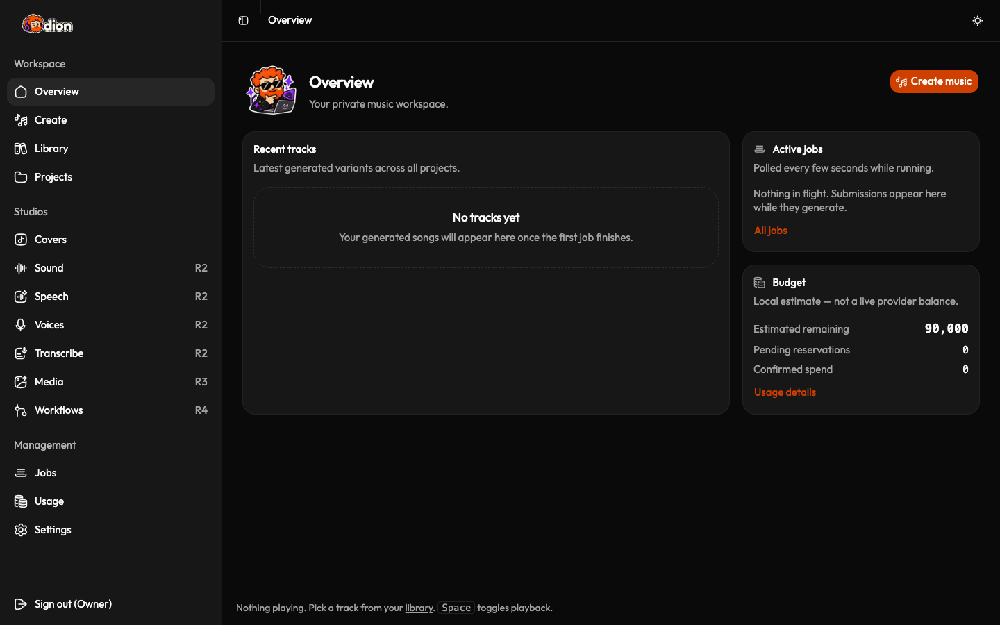
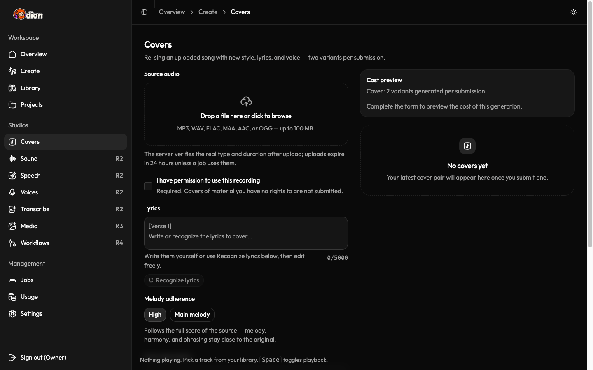
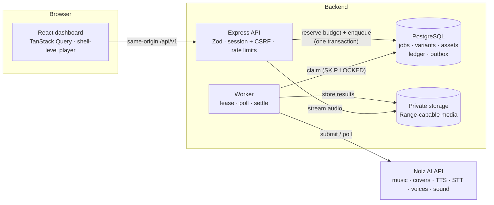
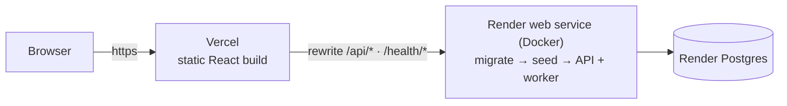

<div align="center">


### Your private AI music studio

Write a brief and get two song variants back. You can also make covers, sound effects, speech, cloned voices and transcripts, and see what each one costs before you spend anything.


[](https://dion-blond.vercel.app)
[](https://dion-api.onrender.com/health/live)

**[▶ Live demo: dion-blond.vercel.app](https://dion-blond.vercel.app)**<br/>
<sub>A private, single-owner studio: visitors can look around, and creating requires the owner's sign-in. It runs in mock mode, so it never spends real credits.</sub>

</div>

---

## Meet Dion

Dion is a curly-haired producer with headphones on, and the studio is built around him. He waits with you while a track renders, celebrates when it's done, scratches his head when something can be fixed, and points you home from a 404.

Behind him is a full-stack app for **generative audio**. It sits on top of the [Noiz AI](https://developers.noiz.ai) API and runs the parts a demo usually skips:

- background jobs that survive a restart
- protection against paying twice for one request
- a budget ledger that only charges for confirmed results
- clear handling of what the AI provider did or didn't do

<p align="center">
  
</p>

## Features

### 🎵 Music (core)
- **Song composer.** Describe a song, then either write the lyrics or give a short brief and let the model write them. Each submission returns **two variants** to compare.
- **Cost before you commit.** A server-side estimate shows the credits it will reserve, the pricing version, and a note that the final charge depends on the length Noiz actually generates.
- **Jobs that survive anything.** Jobs keep running in the background, so you can close the browser or restart the server without losing a song.
- **Library and player.** Search, filter, favorite, rename and organise tracks into projects. A player stays at the bottom across pages, supports seeking, and lets you switch between the two variants.

### 🎙️ Audio studio
- **Covers.** Upload a song, run optional lyric recognition, edit the lyrics, choose how closely to follow the melody, and get two cover variants.
- **Sound effects** from a text prompt, 1–30 seconds, WAV or MP3.
- **Speech (TTS)** with built-in, cloned or designed voices. Long texts up to 50,000 characters are streamed, and an optional step adds emotional tone.
- **Voice library.** Clone a voice from a sample (with a permission check) or design one from a description.
- **Transcription** with detected language, timestamps and speaker labels, exportable as TXT, SRT or JSON.

### 💸 Spending you can trust
- **Two currencies, kept apart:** Noiz credits and pay-as-you-go cash (USD).
- **Cash tools stay off** until you set a monthly USD cap.
- **Every charge is recorded:** reservations, the final charge, and any reconciliation all go into a ledger.
- **Honest labels:** the remaining budget is a *local estimate* and is never shown as a live provider balance.

<table>
  <tr>
    <td></td>
    <td></td>
  </tr>
  <tr>
    <td align="center"><sub>Overview: recent tracks, active jobs, budget</sub></td>
    <td align="center"><sub>Cover studio: upload, recognize lyrics, two variants</sub></td>
  </tr>
</table>

## Architecture



The API answers fast and never waits on the AI provider. When you submit a job, the API reserves budget and adds the job to a database-backed queue, all in **one transaction**. A separate **worker process** claims jobs with a lease (`FOR UPDATE SKIP LOCKED`), sends them to Noiz, polls with backoff, copies the results into private storage, and charges the ledger exactly once.

## Engineering highlights

These are the hard parts of putting a paid generative-AI API into a real product:

| Problem | How Dion handles it |
| --- | --- |
| **Paying twice for one request.** A double-click or a network retry would buy two songs. | Each submission carries a stable idempotency key, and the database enforces one job per key per owner. |
| **Unknown outcomes.** A request might time out after it reached Noiz. | The job is marked `submission_unknown`, and its reservation is kept for reconciliation. It is **never re-sent automatically**. |
| **Double charges.** Charges must stay correct across repeated polling and both song variants. | Settlement uses a unique key (`ON CONFLICT DO NOTHING`), so a pair of variants is charged once, based on the longer one. |
| **Spending more than the budget.** Several tabs could submit at once. | A Postgres advisory lock serializes the budget check and the reservation, with one paid job in flight per billing group. |
| **Errors disguised as success.** Noiz can return an error inside an `HTTP 200` response. Audio endpoints send raw bytes on success but JSON on failure. | The parser checks the response's own error code, never just "HTTP 200 means success". Audio is checked by its file signature (magic bytes) before it's stored. |
| **Docs and real API disagree.** One endpoint's docs and its example script describe different response formats. | The adapter accepts both, falls back safely, and logs a warning when the format differs from the docs. |
| **Downloading from provider URLs.** A malicious URL could make the server fetch internal addresses (SSRF). | `safeFetch` allows https only and resolves DNS first, then rejects private, link-local and metadata IPs. It also re-checks every redirect and caps size and time. |
| **Uploads.** Clients can lie about file types. | Uploads stream to disk, and the type comes from the file's signature, not the client's header. ffprobe checks duration, limits depend on the upload's purpose, and storage keys are random. |
| **Developing without spending.** Building against a paid API costs money. | A **mock provider** simulates every operation offline, which is the default. The live adapter is a drop-in switch. |

Other details:
- **Validation:** strict TypeScript with no `any`, and Zod checks at every boundary.
- **Logging:** structured `pino` logs with cookies and secrets redacted.
- **Database:** Drizzle migrations that only add columns and tables, so existing data is kept.
- **Media:** HTTP Range requests, so seeking works in the player.

## Tech stack

| Layer | Tools |
| --- | --- |
| Frontend | React 19, TypeScript, Vite 8, Tailwind CSS 4, shadcn/ui (Base UI), TanStack Query, React Router, Recharts, Hugeicons |
| Backend | Node.js, Express 5, TypeScript, Zod, express-session, argon2, busboy, pino |
| Data | PostgreSQL, Drizzle ORM and drizzle-kit migrations |
| AI provider | Noiz AI: text-to-music (YuE2), covers, lyric recognition, TTS, voice cloning and design, speech-to-text, emotion enhancement, text-to-sound |
| Quality | Vitest, Supertest (128 backend tests), ESLint, Prettier, Playwright for browser checks |
| Hosting | Vercel (frontend), Render (Docker web service and Postgres) |

## Project structure

```
.
├── client/                 # React dashboard
│   ├── src/pages/          # overview, composer, studios, library, jobs, usage, settings…
│   ├── src/components/     # shell, player, composer, studio panels, shared states, DionMascot
│   ├── src/lib/api/        # typed API client (CSRF, error envelope)
│   └── public/mascot/      # optimized Dion artwork (WebP, transparent)
├── backend/
│   ├── src/routes · controllers · services · repositories · validators
│   ├── src/services/provider/   # mock + live Noiz adapters
│   ├── src/worker/         # job processor (submit → poll → settle) and runner
│   ├── drizzle/            # SQL migrations
│   └── tests/              # integration and adapter tests
├── API_CONTRACT.md         # shared client ↔ backend contract
├── NOIZ_R2_CONTRACTS.md    # provider endpoint research (fields, limits, pricing)
└── PRD.md · todos.md       # product requirements and delivery plan
```

## Getting started

**Prerequisites:** Node.js 20 or newer, npm, and PostgreSQL running on `localhost:5432`.

```bash
git clone https://github.com/Ali747711/Dion-GenAI.git
cd Dion-GenAI

# 1. Databases
psql -d postgres -c "CREATE DATABASE music_studio;"
psql -d postgres -c "CREATE DATABASE music_studio_test;"

# 2. Backend
cd backend
npm install
cp .env.example .env
npm run hash-password -- "choose-a-password"     # paste the hash into OWNER_PASSWORD_HASH
node -e "console.log(require('crypto').randomBytes(32).toString('hex'))"   # paste into SESSION_SECRET
npm run db:migrate && npm run db:seed
npm run dev                                       # API on :4100 + worker

# 3. Frontend (new terminal)
cd client
npm install
npm run dev                                       # http://localhost:5173
```

Open the app and choose **Sign in** at the bottom of the sidebar.

### Mock vs. live mode

| Mode | What it does |
| --- | --- |
| `NOIZ_MODE=mock` (default) | Simulates every operation and spends nothing. Point `MOCK_AUDIO_SOURCE_PATH` at any local audio file to use as the sample song. |
| `NOIZ_MODE=live` | Calls the real Noiz API. Set `NOIZ_API_KEY` in `backend/.env`; it is used only on the server and never sent to the browser. |

### Checks

```bash
cd backend && npm run typecheck && npm run lint && npm test
cd client  && npm run typecheck && npm run lint && npm run build
```

Tests always run against the mock provider and a separate test database. CI never sends a paid request.

## Deployment



| Part | Where | How |
| --- | --- | --- |
| Frontend | Vercel, `client/` | `client/vercel.json` builds with Vite, sends unknown routes to the app, and **rewrites `/api/*` to Render**, so the browser only ever talks to one origin. |
| Backend | Render web service, `backend/` | `backend/Dockerfile` builds on Node 22 with ffmpeg. `npm run start:all` runs migrations, seeds the budget, then starts the API and worker in **one process**. |
| Database | Render Postgres | Connected through the internal `DATABASE_URL`. |

Because Vercel proxies the API, the session cookie belongs to the frontend's own domain and can be `Secure; HttpOnly; SameSite=Lax` with no cross-site cookie setup. The backend trusts exactly one proxy hop (`TRUST_PROXY=1`), so Express sees https and real client addresses. Without that setting, express-session silently drops `Secure` cookies; a regression test now guards against that.

**Production environment** (set as Render secrets, never committed):

| Variable | Value |
| --- | --- |
| `DATABASE_URL` | Render Postgres internal URL |
| `SESSION_SECRET` | 32+ random bytes |
| `OWNER_PASSWORD_HASH` | output of `npm run hash-password -- "<password>"` |
| `NODE_ENV` | `production` |
| `COOKIE_SECURE` | `true` |
| `TRUST_PROXY` | `1` |
| `NOIZ_MODE` | `mock`, or `live` with `NOIZ_API_KEY` |

**Deploying with the CLIs:**

```bash
# Backend: Render CLI (create the database first, then the Docker web service)
render ea pg create --name dion-db --plan free --region singapore
render services create --name dion-api --type web_service --runtime docker \
  --repo https://github.com/Ali747711/Dion-GenAI --branch main --root-directory backend \
  --plan free --region singapore --health-check-path /health/ready \
  --env-var NODE_ENV=production --env-var COOKIE_SECURE=true --env-var TRUST_PROXY=1 \
  --env-var NOIZ_MODE=mock --env-var SESSION_SECRET=... --env-var OWNER_PASSWORD_HASH=...
# Then add DATABASE_URL (the internal URL) in the Render dashboard.

# Frontend: Vercel CLI
cd client && vercel link --project dion && vercel deploy --prod
```

Pushes to `main` redeploy the backend automatically. **Smoke test after a deploy:** check the `Secure` session cookie, sign in, run a mock song through to `succeeded`, make a Range request for the audio (206), and confirm signed-out API calls get 401.

**Free-tier limits of the demo:**
- **Slow first visit:** the Render service sleeps when idle, so the first request takes up to about a minute to wake it.
- **Audio isn't kept:** stored audio lives on the container's disk and is lost when the service restarts.
- **Temporary database:** the free Postgres database expires after 30 days.

A paid plan with a persistent disk, or S3-compatible storage, removes these limits.

## Status and roadmap

- ✅ **Music core.** Composer, two variants, durable jobs, library, projects, player, budget ledger, private sign-in.
- ✅ **Audio studio.** Covers, lyric recognition, sound, speech, voices, transcription, USD cap.
- ✅ **Deployed.** Frontend on Vercel and backend on Render, in mock mode. An independent security review ran before launch, and its findings were fixed with tests.
- 🔄 **Live validation.** The live adapters are built from the Noiz docs and tested with simulated responses. Their error handling has been checked against the real API. Paid generation is the next step to verify.
- 🔜 **Visual assets.** Artwork and short videos for tracks, with cost previews for each model.
- 🔜 **Composed workflows.** Video dubbing, podcast narration and character voices, each enabled only after its own scope and budget review.

## How it was built

Dion was built with an **AI-agent workflow**:

- **Planning:** a PRD and a shared API contract defined the work up front.
- **Parallel agents:** Claude Code split the work into specialised subagents, each with its own skill set. A backend agent built the Express and Drizzle API, a design agent built the shadcn UI, and a research agent turned the Noiz documentation into typed endpoint contracts.
- **Review loop:** every step was verified with type checks, tests and real-browser checks. Bugs found during review (provider errors disguised as success, unsafe retries after sending a paid request, tests leaking into live mode) were fixed with regression tests.

---

<div align="center">
  
  <br />
  <sub>Built by <a href="https://github.com/Ali747711">Ali747711</a> · Powered by the Noiz AI API (not affiliated)</sub>
</div>
